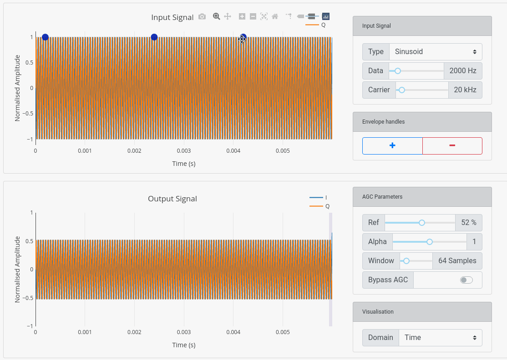

# Automatic Gain Control with PNYQ

## Introduction

We present a digital Automatic Gain Control (AGC) circuit with interactive
control of it's parameters. This is (currently!) a purely digital loopback
system, so no extra hardware is required. We'll generate various input signals,
explore some interesting effects of the AGC algorithm, and practice tweaking our
parameters for best performance. The design of this AGC example will be
explored, featuring various hardware arithmetic approximations for power
estimation, logarithms and exponentiation.



## Quick Start

This repository is compatible with [PYNQ images v2.6 and
greater](https://github.com/Xilinx/PYNQ/releases) for the
[Pynq-Z2](https://www.tul.com.tw/productspynq-z2.html),
[ZCU111](https://www.xilinx.com/products/boards-and-kits/zcu111.html) and the
[RFSoC2x2]().

Connect to the board with **Jupyter Lab** in a browser (not Jupyter Notebook) by
using a web browser `https://<IP address>:9090/lab`.

Open a terminal in Jupyter Lab and run the following command:

```console
root@pynq:/home/xilinx# pip3 install https://github.com/strath-sdr/pynq_agc/releases/download/v0.2/pynq_agc.tar.gz
```

> Note this link won't work on the board until the repo is public. For now,
> we're using my copy from
> `https://cramsay.co.uk/content/images/2021/02/pynq_agc_v0.2.tar.gz`

The notebook should now be available in the `pynq_agc` folder in your Jupyter
Workspace.

## Building from Source

Our hardware design is written in [Clash](https://clash-lang.org/) and
implemented with Vivado 2020.1.

On Linux the only prerequisite is having Vivado 2020.1 installed and in your
`PATH` variable. We supply a [nix shell](https://nixos.org/) which will handle
the rest of the dependencies for you.

If you don't already have the nix package manager, install it with:

```console
sdr@strath$ curl -L https://nixos.org/nix/install | sh
```

To rebuild our project, we just need to source our nix shell (this might take a
while to run the first time --- it's gathering all of the software we need!) and
run `make`.

```console
sdr@strath$ nix-shell
sdr@strath$ make
```

The final pip-installable archive is found at `./pynq_agc.tar.gz`

For Windows (untested), you will need to [manually install Clash](https://clash-lang.org/install/windows/) and all of the Haskell packages listed in `shell.nix`. Alternatively you can use the Linux instructions with the Windows Subsystem for Linux (WSL).

## License
[BSD 3-Clause](./LICENSE)
